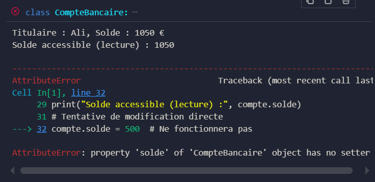
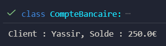

# Encapsulation et Composition en Python

## Objectif du TP
Ce projet regroupe deux exercices visant à approfondir les notions fondamentales de la programmation orientée objet (POO) en Python :

1. Exercice 1 – Encapsulation et propriétés  
2. Exercice 2 – Composition entre classes  

---

## Exercice 1 — Encapsulation : Classe CompteBancaire

### Objectif pédagogique
Appliquer les principes d’encapsulation :
- Utiliser des attributs protégés et privés.  
- Contrôler l’accès aux données internes via des propriétés.  
- Valider les données lors des opérations.  
- Empêcher la modification directe d’attributs sensibles.  

### Étapes d’implémentation
1. Créer une classe `CompteBancaire` avec les attributs `_titulaire` (protégé) et `__solde` (privé).  
2. Ajouter des méthodes pour déposer et retirer de l’argent avec validation.  
3. Utiliser une propriété pour permettre la lecture du solde sans modification directe.  
4. Afficher les informations du compte via une méthode dédiée.  

### Résultat attendu
- Le solde ne peut pas être modifié directement.  
- Les opérations invalides sont bloquées avec un message d’erreur.  
- L’affichage montre le titulaire et le solde actuel.  

### Résultat (capture d’écran)

---

## Exercice 2 — Composition : Classes Client et CompteBancaire

### Objectif pédagogique
Mettre en œuvre une relation de composition entre deux classes :
- Un client possède un compte bancaire.  
- La classe `Client` interagit avec `CompteBancaire` sans héritage.  
- Illustration du principe « a un » (has-a).  

### Étapes d’implémentation
1. Créer une classe `CompteBancaire` gérant un solde privé et des méthodes pour déposer et retirer.  
2. Créer une classe `Client` possédant un nom et une instance de `CompteBancaire`.  
3. Ajouter une méthode `afficher()` pour présenter le nom du client et le solde de son compte.  

### Résultat attendu
- Le client peut interagir avec son compte via des méthodes dédiées.  
- Le solde affiché correspond aux opérations effectuées.  

### Résultat (capture d’écran)

---

## Bilan du TP

| Concept | Description |
|----------|--------------|
| Encapsulation | Protection des données internes d’une classe |
| Attributs privés/protégés | Contrôle de l’accès via `_` et `__` |
| Propriétés | Lecture contrôlée d’un attribut |
| Composition | Relation logique entre deux classes |
| Validation | Sécurisation des opérations sur les données |

---

## À retenir
L’encapsulation protège les données et assure l’intégrité des objets,  
tandis que la composition permet de construire des relations logiques entre classes sans héritage.  
Ces deux principes rendent le code plus fiable, clair et modulaire.

---

## Auteur
Projet réalisé par **El Mezouari Abdelhadi**  
Module : Programmation Orientée Objet — Python  
École : École Normale Supérieure (ENS)
